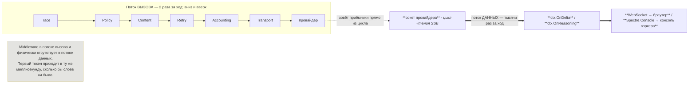
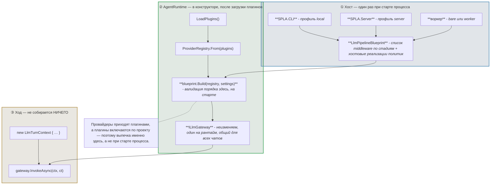
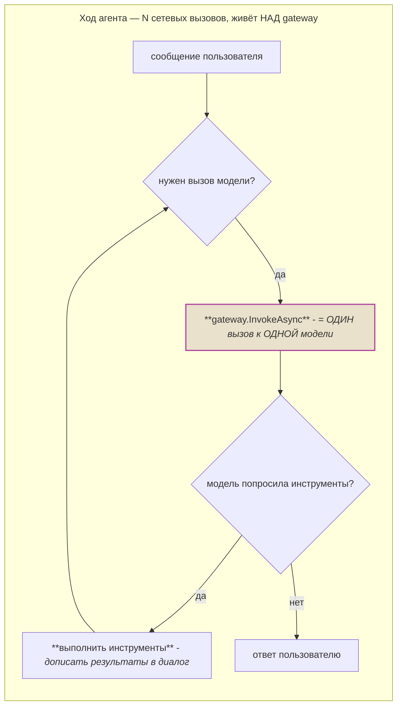

# Конвейер LLM — схемы

Визуальное приложение к [`ADR_20260731_llm_pipeline.md`](ADR_20260731_llm_pipeline.md). Текст решений и
обоснования — там; здесь только устройство. При расхождении прав основной документ.

---

## 1. Устройство конвейера

Прямоугольник `КОНВЕЙЕР` — это то, что печётся один раз и дальше не меняется. Внутри — стадии;
порядок задаётся стадией middleware, а не порядком регистрации.

```mermaid
%%{init: {'flowchart': {'subGraphTitleMargin': {'top': 12, 'bottom': 12}, 'nodeSpacing': 40, 'rankSpacing': 50, 'wrappingWidth': 450, 'htmlLabels': true}}}%%
flowchart TB
    CALLER["**Вызывающий** - <i>ConversationOrchestrator · SpawnedAgentRunner · воркер</i>"]
    CTX["**LlmTurnContext** - <i>создаётся на каждый ход: сообщения · инструменты · настройки · modelId · приёмники OnDelta / OnReasoning</i>"]
    GW["**ILlmGateway** - <i>единственный публикуемый вход</i>"]

    CALLER --> CTX --> GW

    subgraph PIPE["КОНВЕЙЕР — испечён один раз, неизменяем, потокобезопасен"]
        direction TB

        subgraph ST1["① Trace"]
            direction TB
            M1["**Trace** - <i>трасса хода; снаружи всего, чтобы отказ тоже был виден</i>"]
            M2["**ConnectionResolve** - <i>id → дескриптор + провайдер + capabilities; дальше id никто не резолвит</i>"]
            M1 --> M2
        end

        subgraph ST2["② Policy — открыта плагинам"]
            direction TB
            M3["**Authorize** - <i>можно ли этому caller'у это подключение и эту модель</i>"]
            M4["**Privacy** - <i>можно ли ЭТОТ контент в ЭТО подключение</i>"]
            M5["**Quota** - <i>предпроверка бюджета</i>"]
            M3 --> M4 --> M5
        end

        subgraph ST3["③ Content — открыта плагинам"]
            direction TB
            M6["**CapabilityGuard** - <i>vision / tools / reasoning против capabilities → внятная ошибка ДО сети</i>"]
            M7["**ContentPolicy** - <i>даунскейл картинок, лимиты вложений</i>"]
            M6 --> M7
        end

        subgraph ST4["④ Retry — запечатана"]
            M8["**Retry** - <i>только транзиентные, только то же подключение и та же модель</i>"]
        end

        subgraph ST5["⑤ Accounting — запечатана"]
            M9["**Usage** - <i>try/finally вокруг вызова: отмена и ошибка тоже дают строку</i>"]
        end

        subgraph ST6["⑥ Transport — запечатана"]
            M10["**Credentials** - <i>резолв секрета в последний момент, дальше материал не оседает</i>"]
        end

        ST1 --> ST2 --> ST3 --> ST4 --> ST5 --> ST6
    end

    GW --> ST1
    ST6 --> PROV["**ILlmClient** - <i>терминальный шаг, единственное место, знающее провод: LM Studio · OpenAI · Anthropic · Google</i>"]
    PROV --> RES["**LlmTurnResult** - <i>message · rawUsage · modelReported · status</i>"]
    RES -.- BACK["обратный ход через те же слои — назад к вызывающему"]

    classDef open fill:#1f5c2e22,stroke:#2f9e4f,stroke-width:2px
    classDef sealedStage fill:#5c1f1f22,stroke:#b34747,stroke-width:2px
    classDef neutral fill:#3a3a3a22,stroke:#888,stroke-width:1px
    class ST2,ST3 open
    class ST4,ST5,ST6 sealedStage
    class ST1 neutral
```

Зелёные стадии открыты плагинам, красные запечатаны хостом. `UseFromPlugin` бросает исключение при
попытке встать в запечатанную — «плагин обнулил учёт» невозможен **по построению**, а не по ревью.

`Retry` — отдельная стадия не для красоты: будь он частью `Transport`, он оказался бы внутри
`Accounting`, и три сетевые попытки записались бы одной строкой. Каждая попытка стоит денег.

---

## 2. Два потока: вызов и данные

Главный вопрос про конвейер — «а живой вывод рассуждений не сломается?». Не сломается, потому что
поток данных проходит мимо слоёв.

Отсюда три правила: приёмники остаются приёмниками (никаких `IAsyncEnumerable` вверх через слои);
обёртка приёмника пересылает чанк **немедленно** и только потом что-то с ним делает; в обёртке —
только дешёвая неблокирующая работа, потому что приёмник ожидается внутри цикла чтения сокета.

---

## 3. Сборка и время жизни

Три уровня с тремя разными временами жизни. Путать их — главный способ сгноить такую архитектуру.

Две ловушки, которые эта схема должна напоминать:

- **не захватывать `ResolvedSettings` в замыкание middleware** — настройки живые, читать через
  аксессор, иначе правка подключения перестанет доезжать;
- **правка подключений не требует пересборки** (резолвятся на ходе), смена набора плагинов —
  требует, и это уже событие уровня рантайма.

---

## 4. Граница, которую нельзя двигать

Всё, что рассуждает о ходе целиком — уплотнение контекста, цикл инструментов, сборка промпта, —
**не middleware**. Иначе получится второй оркестратор, конкурирующий с настоящим.
